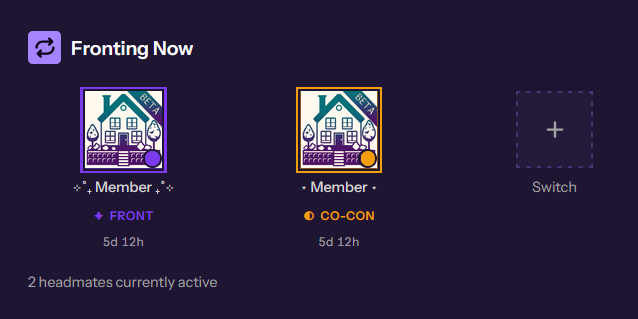
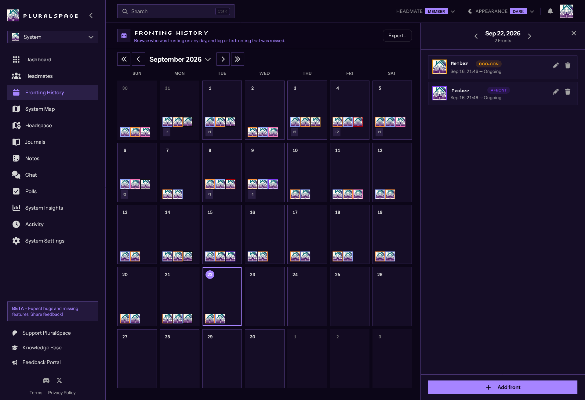
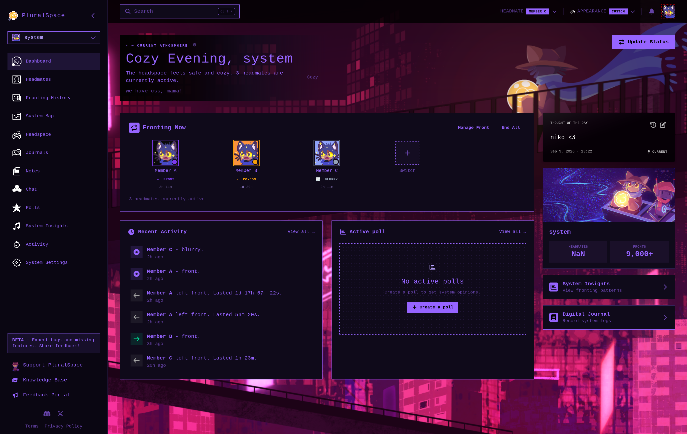
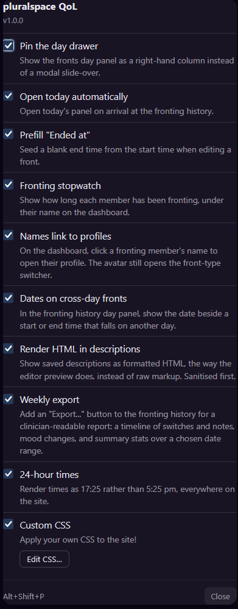
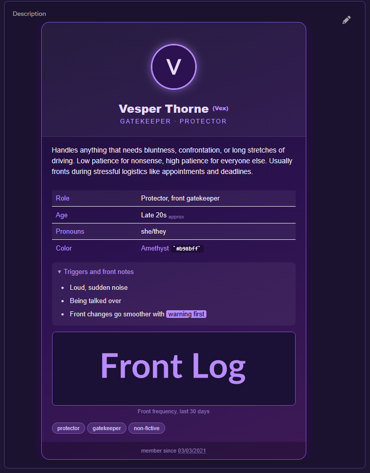

# pluralspace-qol


<p>
  
  Userscript quality-of-life tweaks for <a href="https://pluralspace.app">pluralspace.app</a>
</p>

<br>

## Contents

- [Installation](#installation)
- [Screenshots](#screenshots)
- [Tweaks](#tweaks)
  - [A Note on Custom CSS](#a-note-on-custom-css)
  - [A Note on the Weekly Report](#a-note-on-the-weekly-report)
  - [A Note on HTML Descriptions](#a-note-on-html-descriptions)
  - [A Note on 24-hour Time](#a-note-on-24-hour-time)
- [Development](#development)
  - [Checks](#checks)
  - [Snapshots and Fixtures](#snapshots-and-fixtures)
- [Disclaimer](#disclaimer)
- [License](#license)

## Installation

1. Install a userscript manager from your browser's extension store
   (Tampermonkey, Violentmonkey, etc.)
2. Install
   [`src/pluralspace-qol.user.js`](https://github.com/LordHerdier/pluralspace-qol/raw/refs/heads/main/src/pluralspace-qol.user.js)

The script contains `@updateURL`/`@downloadURL` pointing at the git repo, so it
will automatically update when a new version is released.

Press **Alt+Shift+P** on any pluralspace page for the script's settings panel.

## Screenshots

<details>
  <summary>Screenshots (click to expand)</summary>
<table border="0" cellspacing="0" cellpadding="0">
  <tr>
    <td align="center" width="33%">
      <br>
      <sub>Fronting</sub>
    </td>
    <td align="center" width="33%">
      <br>
      <sub>Calendar</sub>
    </td>
    <td align="center" width="33%">
      <br>
      <sub>CSS Themes</sub>
    </td>
  </tr>
  <tr>
    <td align="center" width="33%">
      <br>
      <sub>Settings</sub>
    </td>
    <td align="center" width="33%">
      <br>
      <sub>Custom HTML Description</sub>
    </td>
    <td></td>
  </tr>
</table>

<details>
<summary>Custom Sources (click to expand)</summary>
<br>

CSS Theme:
[pluralspace-oneshot-theme](https://github.com/LordHerdier/pluralspace-oneshot-theme)

HTML Description:

```html
<div
    style="max-width:520px;margin:0 auto;border-radius:16px;background:linear-gradient(160deg,#1b1035 0%,#2c1250 50%,#3d1a56 100%);padding:0;font-family:sans-serif;color:#f1e9ff;border:1px solid #7a4fc9;overflow:hidden;box-shadow:0 6px 24px rgba(76,0,130,0.4);">
    <div
        style="padding:18px 20px;background:rgba(255,255,255,0.05);border-bottom:1px solid rgba(255,255,255,0.1);">
        <center><h1 style="margin:10px 0 2px 0;font-size:22px;color:#e8d9ff;">Vesper Thorne <sup style="font-size:11px;color:#b98bff;">(Vex)</sup></h1><div style="font-size:12px;color:#b98bff;letter-spacing:2px;text-transform:uppercase;">Gatekeeper &middot; Protector</div></center>
    </div>
    <div
        style="padding:16px 20px;"><p style="font-size:14px;line-height:1.5;margin:0 0 12px 0;">Handles anything that needs bluntness, confrontation, or long stretches of driving. Low patience for nonsense, high patience for everyone else. Usually fronts during stressful logistics like appointments and deadlines.</p><table style="width:100%;border-collapse:collapse;font-size:13px;margin-bottom:12px;"><tr style="background:rgba(255,255,255,0.05);"><td style="padding:6px 8px;color:#b98bff;width:35%;">Role</td><td style="padding:6px 8px;">Protector, front gatekeeper</td></tr><tr><td style="padding:6px 8px;color:#b98bff;">Age</td><td style="padding:6px 8px;">Late 20s <sub style="font-size:10px;color:#8a75b8;">approx</sub></td></tr><tr style="background:rgba(255,255,255,0.05);"><td style="padding:6px 8px;color:#b98bff;">Pronouns</td><td style="padding:6px 8px;">she/they</td></tr><tr><td style="padding:6px 8px;color:#b98bff;">Color</td><td style="padding:6px 8px;"><font color="#b98bff">Amethyst</font> <code style="background:rgba(0,0,0,0.3);padding:1px 5px;border-radius:4px;">#b98bff</code></td></tr></table><details style="background:rgba(255,255,255,0.05);border-radius:8px;padding:8px 12px;margin-bottom:12px;"><summary style="cursor:pointer;color:#b98bff;font-size:13px;">Triggers and front notes</summary><ul style="margin:8px 0 0 0;padding-left:18px;font-size:13px;color:#d8c8ff;"><li>Loud, sudden noise</li><li>Being talked over</li><li>Front changes go smoother with <mark style="background:#b98bff;color:#1b1035;padding:0 4px;border-radius:3px;">warning first</mark></li></ul></details><figure style="margin:0 0 12px 0;text-align:center;"><figcaption style="font-size:11px;color:#8a75b8;margin-top:4px;">Front frequency, last 30 days</figcaption></figure><span style="background:rgba(185,139,255,0.18);color:#d8c8ff;font-size:11px;padding:4px 10px;border-radius:999px;border:1px solid rgba(185,139,255,0.4);">protector</span> <span style="background:rgba(185,139,255,0.18);color:#d8c8ff;font-size:11px;padding:4px 10px;border-radius:999px;border:1px solid rgba(185,139,255,0.4);">gatekeeper</span> <span style="background:rgba(185,139,255,0.18);color:#d8c8ff;font-size:11px;padding:4px 10px;border-radius:999px;border:1px solid rgba(185,139,255,0.4);">non-fictive</span></div>
    <div
        style="padding:8px 20px;background:rgba(0,0,0,0.25);text-align:center;font-size:11px;color:#8a75b8;">member since <abbr title="March 3, 2021">03/03/2021</abbr></div>
</div>
```

</details>
</details>

## Tweaks

| Tweak                           | What it does                                                                                                                                                                                                                      |
| ------------------------------- | --------------------------------------------------------------------------------------------------------------------------------------------------------------------------------------------------------------------------------- |
| **Pin the day drawer**          | On the calendar page, this shows the day panel as a right-hand column instead of a modal slide-over, so the calendar stays visible and clickable.                                                                                 |
| **Open today automatically**    | Opens today's panel on arrival at the fronting history.                                                                                                                                                                           |
| **Prefill "Ended at"**          | Seeds a blank end time from the start time when editing a front, instead of making you retype the date.                                                                                                                           |
| **Fronting stopwatch**          | Shows how long each member has been fronting, under their name in the dashboard's _Fronting Now_ card.                                                                                                                            |
| **Names link to profiles**      | Clicking on a member's name on the dashboard will bring you to their profile. Clicking their picture still allows adjusting front status.                                                                                         |
| **Dates on cross-day fronts**   | In the fronting history's day panel, shows the date beside a start or end time that falls on another day, so a front that ran past midnight reads as `Sep 3, 11:40 pm → 1:15 am` rather than an unexplained `11:40 pm → 1:15 am`. |
| **Render HTML in descriptions** | Shows saved descriptions as formatted HTML, the way the editor's preview does, instead of raw markup. Sanitised first. ([see below](#a-note-on-html-descriptions))                                                                |
| **24-hour times**               | Renders times as `17:25` rather than `5:25 pm`, everywhere on the site.                                                                                                                                                           |
| **Weekly export**               | Adds an "Export…" button to the fronting history for a clinician-readable report over a chosen date range: a timeline of switches (with notes) and mood changes, plus summary stats. ([see below](#a-note-on-the-weekly-report))  |
| **Custom CSS**                  | Lets you paste your own CSS to apply on every pluralspace page, without installing a separate extension like Stylus. ([see below](#a-note-on-custom-css))                                                                         |

### A Note on Custom CSS

The settings panel has an "Edit CSS…" button next to the **Custom CSS**
checkbox, opening a text box for arbitrary CSS. It's injected as a plain
`<style>` element, saved to `localStorage` alongside the tweak toggles, and
applied on every page load while the checkbox is on. Disabling the tweak just
removes the `<style>` element without touching what you wrote.

There's no sanitizing or validation. It's your own CSS, running on a site you're
logged into. Same trust boundary as a Stylus style.

### A Note on the Weekly Report

This builds a clinician-readable report on switches, notes, and mood changes + a
summary.

Member names use each member's actual **Name** field rather than their **Display
Name**. The report opens in a new tab as a plain HTML page, with a "Print / Save
as PDF" or "Download CSV" button.

This is capped to 2,000 events in the report. If you need more, let me know and
I can see about writing a different tool for an export.

### A Note on HTML Descriptions

The editor's live preview renders raw HTML, while a saved description shows it
as literal markup. To be clear: _this is a bug in pluralspace.app on the preview
side_. Their sanitization is deliberately an XSS defense rather than an
oversight.

This tweak is a client-side workaround, not a fix, and turning it on means
opting into rendering HTML from pages that may not be your own. It _is_ passed
through a sanitizer and URLs are removed, so nothing should execute or load.

What the sanitizer does **not** stop is CSS. Inline `style` is allowed, since
that's the point of the feature.

Just be mindful when browsing strangers' profiles with it on.

### A Note on 24-hour Time

Pluralspace.app's time helper hardcodes `hour12:true` and ignores browser locale
settings. This tweak patches the formatter.

The `datetime-local` _input_ fields are native controls formatted by the
browser, which no userscript can restyle. If they show AM/PM, that is a browser
setting rather than the app.

## Development

Everything runs offline against saved fixtures. No login and no network needed.

```bash
nix develop            # node, playwright browsers, entr
npm i                  # playwright, pinned to the nixpkgs driver version
node scripts/serve.js  # serves src/ on :8137
```

Then install [`src/dev-loader.user.js`](src/dev-loader.user.js) **once**. It
fetches the real script from the dev server on every page load, so editing the
file and refreshing the tab is the whole loop with no reinstallation required.

The loader deliberately avoids `@require`, which Tampermonkey caches on its own
schedule regardless of cache headers. That failure mode is invisible and costs
real time: the browser silently keeps running an old version while you debug
changes it never received. If behaviour ever seems frozen, check the
`[ps-qol] loaded vX.Y.Z` line in the console before anything else.

> Changing a `@grant` in the loader means reinstalling it. A refresh will not
> pick that up.

### Checks

```bash
node scripts/check-layout.js      # pinned drawer geometry
node scripts/check-early.js       # document-start path
node scripts/check-prefill.js     # end-time prefill, incl. the events Vue needs
node scripts/check-24h.js         # formatter patch, against the app's own helper
node scripts/check-config.js      # settings panel and per-tweak gating
node scripts/check-stopwatch.js   # elapsed formatting, ticking, re-render recovery
node scripts/check-description.js # HTML rendering and the sanitiser
node scripts/check-namelinks.js   # profile navigation from the dashboard
node scripts/check-frontdates.js  # dates on fronts that cross midnight
node scripts/check-export.js      # weekly export: bridge, report content, escaping
```

They drive real Chromium over the fixtures, so they measure actual computed
geometry rather than asserting on strings. Run them after any change to the CSS
or the timing.

### Snapshots and Fixtures

The checks need real app markup that comes from DOM captures of a logged-in
session.

You can extract this with devtools:

```js
copy(document.documentElement.outerHTML);
```

and save them into `snapshots/`. **These captures contain member names, avatar
URLs, account ids, front notes, and more PII**. `scripts/scrub.js` turns them
into the committed `fixtures/`:

```bash
node scripts/scrub.js
```

It derives the identifying labels from each snapshot rather than storing a list,
replaces them with `Member A..`, blanks avatars, rewrites uuids and emails, and
strips scripts. Free text is handled by exclusion: anything over 30 characters
that is not allowlisted app chrome is redacted **and reported**, so a new
snapshot containing text it has never seen fails loudly rather than leaking
quietly. It then greps its own output and exits non-zero if anything survives.

After capturing new snapshots: run the scrub, read the redaction report, commit
`fixtures/`.

`fixtures/app.css` is the app's stylesheets vendored once (~1.1 MB). Three of
the checks measure real geometry and so need real CSS; linking the live URL
would break on pluralspace's next deploy, since its asset names are
content-hashed.

## Disclaimer

This project is in no way affiliated with pluralspace.app or its developers.
They're great and you should
[support them](https://www.patreon.com/cw/PluralSpace)!

Also a note regarding the pre-1.0 git history: it was developed on a private git
repo while I was still figuring things out. It contained a _lot_ of personal
information that would have been infeasible to scrub from the git history. Hence
the new, public repo.

## License

See [`LICENSE`](LICENSE) for details.
